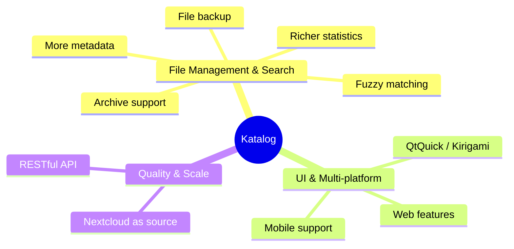

# Roadmap
 

## Vision

Katalog aims to provide the richest set of features for device and file management across as many platforms as possible — starting from KDE Plasma on Linux, extending toward Windows, mobile, and web.

## Ideas and directions

## Backlog

Active and planned work items are tracked in the [GitHub Backlog — Major Features](https://github.com/users/StephaneCouturier/projects/7/views/1?sliceBy[value]=1_Major_feature).
