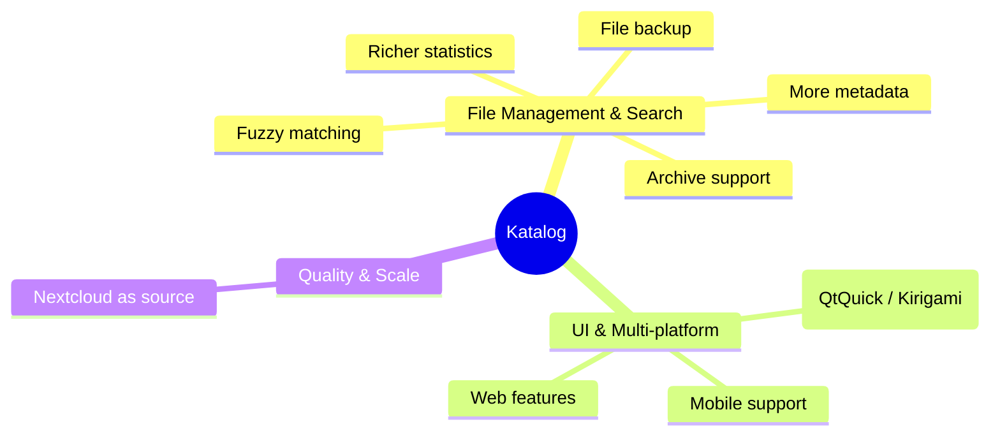

# Roadmap
 

## Vision

Katalog aims to provide the richest set of features for device and file management across as many platforms as possible — starting from KDE Plasma on Linux, extending toward Windows, mobile, and web.

## Ideas and directions

## Backlog

Active and planned work items are tracked in the [GitHub Backlog — Major Features](https://github.com/users/StephaneCouturier/projects/7/views/1?sliceBy[value]=1_Major_feature).

---
## Katalog 3

### Introduction
Katalog 3 is a major Version of Katalog, marking the transition to a more modern UI, usable even on tablets/smartphones.
It relies on QtQuick and Kirigami from KDE.

###  Codebase structure & transitions

Katalog 2 will continue to be maintained, at least until Katalog 3 covers all features.

This is enabled by having done a full split of UI and backend (the `/core` directory).

The common use of `/core` means that **Collections will remain compatible to both versions**.
* core/           shared business logic (SQL, search, catalog ops, device ops)
* qt_widgets/     Katalog2 — Qt Widgets, KXmlGui
* qt_quick/       Katalog3 — Qt Quick, QML, Kirigami

At some point, it is possible that new features, especially if involving a lot of UI work, will only be developped in Katalog 3 directly.

 
## Development phases

| Phase | Scope                                          | Status | K3 Notes |
|-------|------------------------------------------------|--------|----------|
| 1     | READ ONLY, Basic Search features, English Only |   🚧   |          |
| 2     | Theme & Translations                           |   🔲   |          |
| 3     | READ ONLY advanced / graphical features        |   🔲   |          |
| 4     | CREATE / EDIT features                         |   🔲   |          |

Legend: ✅ Done · 🚧 Partial · 🔲 Not started

## Detailed Status

| Screen / Feature      | K2 | K3 | Remaining |
|-----------------------|----|----|----------|
| **Open Collection**   | ✅ | 🚧 | (code improvement only) DatabaseManager refactor.  Move reconnect/settings orchestration from AppManager to core |
| **Selection**         | ✅ | 🚧 | Refresh from db |
| **Search**            | ✅ | 🚧 | |
| — Search criteria     | ✅ | ✅ | |
| — Search results      | ✅ | ✅ | |
| — Search history      | ✅ | 🔲 | |
| — Search in Connected | ✅ | 🔲 | |
| — Search pause/stop   | ✅ | 🔲 | |
| **Devices**           | ✅ | 🔲 | |
| — View                | ✅ | 🔲 | |
| — Create/Edit         | ✅ | 🔲 | |
| **Explore**           | ✅ | 🔲 | |
| **Create**            | ✅ | 🔲 | |
| **Statistics**        | ✅ | 🔲 | |
| **Tags**              | ✅ | 🔲 | |
| **Backup**            | ✅ | 🔲 | |
| — View                | ✅ | 🔲 | |
| — Create              | ✅ | 🔲 | |
| — Execute             | ✅ | 🔲 | |
| **Settings**          | ✅ | 🚧 | |
| — SettingsFile        | ✅ | ✅ | |
| — Various             | ✅ | 🔲 | check version at start|
| — Themes              | ✅ | 🔲 | |
| — Language            | ✅ | 🔲 | |
| **About**             | ✅ | ✅ | |

  
