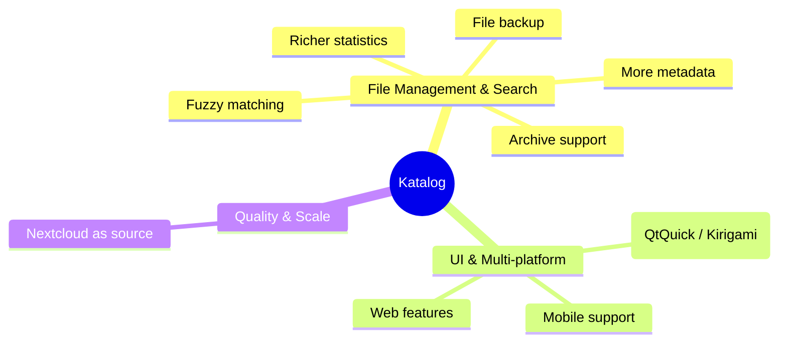

# Roadmap
 

## Vision

Katalog aims to provide the richest set of features for device and file management across as many platforms as possible — starting from KDE Plasma on Linux, extending toward Windows, mobile, and web.

## Ideas

## Backlog

Active and planned work items are tracked in the [GitHub Backlog — Major Features](https://github.com/users/StephaneCouturier/projects/7/views/1?sliceBy[value]=1_Major_feature).

---
## Katalog 3

### Introduction

**Katalog 3** is a new major version of Katalog, transitionning to a more modern UI, and fitting future tablets & smartphones use. It relies on QtQuick and Kirigami from KDE.

**Katalog 2** remains the current major version, until Katalog 3 covers all existing features. Katalog 2 may be maintained beyond Katalog 3 full release, as long as UI work is light.

**Katalog 3.0** will therefore be the first complete release and will become then the main version.  Until then, the main release will still be 2.x but will include binaries **Katalog 3.alpha.x**.

This is enabled by having done a full split of UI and backend, and the common use of `/core` (backend) means that **Collections will remain compatible to both versions**.

 
### Development phases

#### Code management:
see [Development-Repository](http://localhost:3000/Katalog/docs/Development-Repository)

#### Phases
Legend: ✅ Done · 🚧 Partial · 🔲 Not started

| Phase | Feature Scope                                                      | Status | Katalog 3 Version |
|-------|--------------------------------------------------------------------|--------|-------------------|
| 1     | READ ONLY, Search features, English Only                           |   ✅   | Katalog 3.alpha1  |
| 2     | READ ONLY advanced / graphical features / Themes / Translations    |   🔲   |                   |
| 3     | CREATE / EDIT features                                             |   🔲   |                   |

| Platform |  Status | Notes                           |
|----------|---------|---------------------------------|
| Linux    |    ✅   | Primary dev environment         |
| Windows  |    ✅   | Build works with Craft          |
| macOS    |    ✅   | Build works in GitHub Actions   |

### Detailed status by Feature 

| Screen / Feature      | K2 | K3 | Remaining | New feature vs K2 |
|-----------------------|----|----|-----------|-----------|
| **Screen/tabs**       | ✅ | ✅ | | - Access via a "Drawer" now, which can be hidden or pinned" |
| **Open Collection**   | ✅ | 🚧 |create collection (File mode) | - Clearer selection of mode and Collection. Open recent collections (last 5 entries)|
| **Selection**         | ✅ | ✅ | | - Card like entries with file & storage statistics  - Filter option to limit the list of Devices
| **Search**            | ✅ | 🚧 | |
| — Search Criteria     | ✅ | ✅ | | - Paste/Clean buttons for all text input fields|
| — Search Results      | ✅ | ✅ | | - Select Device path is displayed
| — Search History      | ✅ | ✅ | |
| — Search in Connected | ✅ | ✅ | |
| — Search Progress     | ✅ | ✅ | result throttler| |
| — Search Pause/Stop   | ✅ | 🔲 | Review thread mechanism compared to BackUp | |
| **Create**            | ✅ | ✅ | Review thread mechanism compared to BackUp, Add Paste button, Add Paste from selected path & name | |
| **Devices**           | ✅ | 🔲 | |
| — View list           | ✅ | 🔲 | |
| — Edit                | ✅ | ✅ | |
| — Update progress     | ✅ | 🔲 | |
| **Explore**           | ✅ | 🔲 | |
| **Statistics**        | ✅ | 🚧 | zoom in feature, axis labels|
| **Tags**              | ✅ | ✅ | |
| **Backup**            | ✅ | 🚧 | |
| — View                | ✅ | 🔲 | |
| — Create              | ✅ | 🔲 | |
| — Execute/progress    | ✅ | 🔲 | |
| **Settings**          | ✅ | 🚧 | |
| — SettingsFile        | ✅ | ✅ | |
| — Version             | ✅ | ✅ | |
| — Image folder        | ✅ | ✅ | |
| — New & Import        | ✅ | ✅ | |
| — Themes              | ✅ | 🔲 | |
| — Languages           | ✅ | 🚧 | |
| **About**             | ✅ | ✅ | |

### Feedback & Support

Bugs: https://github.com/StephaneCouturier/Katalog/issues

Feedback (UI, ideas, etc.): https://github.com/StephaneCouturier/Katalog/discussions

